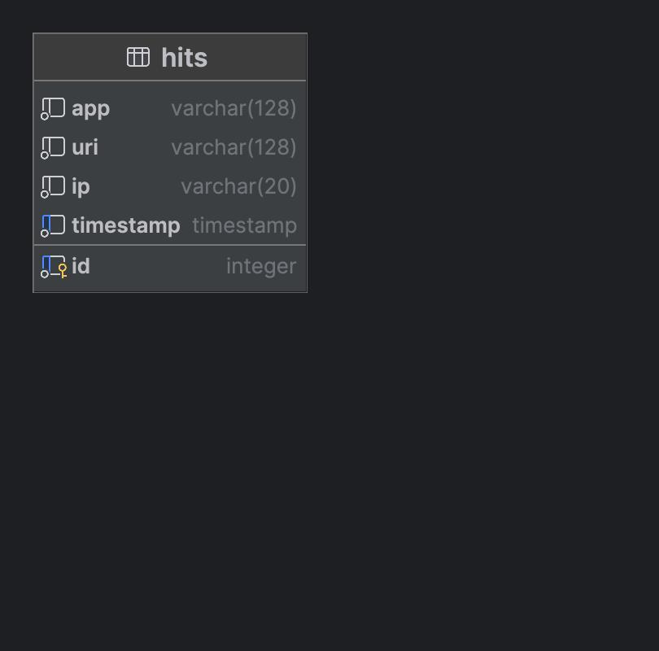
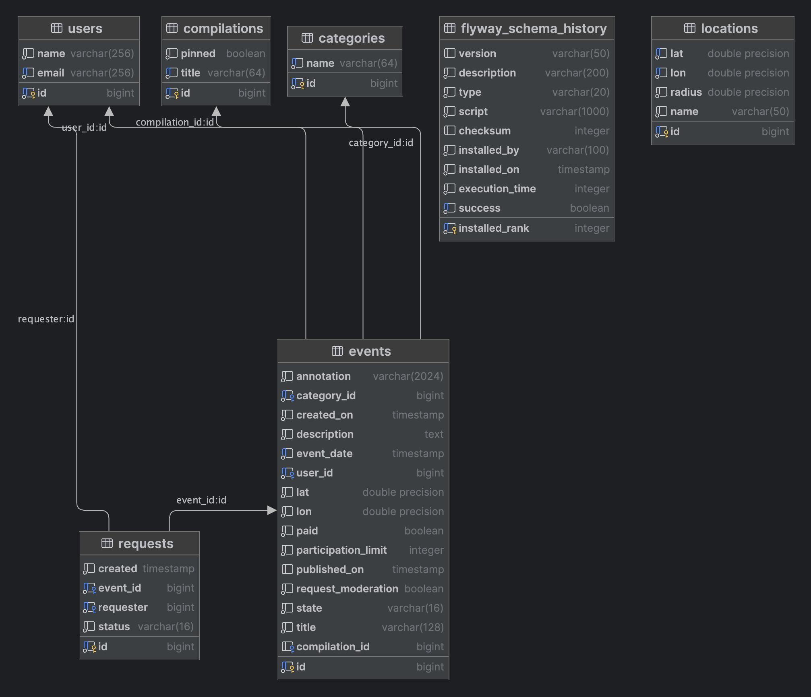

# java-explore-with-me

Educational Project from Yandex Practicum Java Developer course.

### Remarks on API
The API is divided into three logical parts:
1. public - available to any user without registration
2. private - available only to registered and authorized users
3. admin - available only to the admins of the service

#### Note
The project doesn't handle any cross-cutting concerns like: user registration, authentication and authorization.
It is assumed, that all requests come from a gateway service, which is responsible for
registering, authorizing and authenticating a user as well as routing requests.
Therefore the API is divided logically by endpoint names.

## Tech Stack
1. Java
2. Spring Boot
3. Lombok
4. PostgreSQL
5. Flyway 
6. TestContainers
7. Docker
8. Hibernate
9. Spring Data JPA

## Architecture

The project consists of two modules (aka microservices):
1. ewm-service
2. stats-server


### ewm service
Contains all the business logic necessary for the app functionality.

The service is split into logically divided packages:
- Categories
- Compilations
- Events
- Locations
- Requests
- UserManagement

Each package has its own functionality. 
#### Categories
It has public and admin endpoints:
1. public provides functionality to:
   - get all categories by pages
   - get a category by its ID
2. admin provides functionality to:
   - create a new category
   - delete a category
   - update a category

#### Compilations
It has public and admin endpoints:
1. public provides functionality to:
   - get all compilations by filters:
     - pinned
     - from
     - size
   - get a compilation by its ID
2. admin provides functionality to:
   - create a compilation
   - delete a compilation
   - update a compilation

#### Events
It has public, private and admin endpoints:
1. public provides functionality to:
   - get events by location ID
   - get events by location coordinates
   - get all events
   - get event by id

Each request saves statistics to the statistics server.
Requests that retrieve potentially large amount of data have filters:
- text that must be either in title or description of the event (optional)
- list of categories the event belongs to (optional)
- whether the event is paid or not (optional)
- start date of the event (optional)
- end date of the event (optional)
- only available for visiting (i.e. the event has not reached its participant limit) default value is false
- sort (optional): 
  - event date
  - event views
- page start (default value 0)
- page size (default value 10)

2. admin provides functionality to:
   - search for events
   - update events (decline or accept the event)
3. private provides functionality to:
   - get all events added by current user
     - uses offset based paging
   - add event
   - get detailed info about an event added by current user by the event ID
   - update the event added by current user
   - get info about requests to participate in the event by other users
   - accept or decline participation requests by other users

#### Locations
It has public and admin parts:
1. public provides functionality to:
   - get all locations registered in the system
     - uses offset-based paging
2. admin provides functionality to:
   - add location

#### Requests
It has only private part that provides functionality to:
- get all participation requests of a user by the user ID
- create a request to take part in an event
- cancel a request to take part n an event

#### UserManagement
It has only admin part that provides functionality to:
- get all users
  - uses offset-based paging
- create a user
- delete a user


### stats server
1. Collects statistics about user interactions with public endpoints: 
   - when user views a listing with events
   - when user views detailed information about an event
2. Provides endpoint to get statistics for a list of endpoints

### Communication between services
Communication is performed via REST API by means of Spring's RestTemplate. That is
the communication is synchronous. 

## Database
Each service uses its own database - PostgreSQL. 

#### stats server schema:


#### ewm service schema:


## API description
API of both services is described using OpenAPI.

#### stats server API:
https://github.com/aasmc/java-explore-with-me/blob/main/ewm-stats-service-spec.json

#### ewm service API:
https://github.com/aasmc/java-explore-with-me/blob/main/ewm-main-service-spec.json

## Testing
The project has several types of tests:
1. Unit tests with Mockito
2. Database tests with @DataJpaTest and TestContainers
3. Integration tests with @SpringBootTest, TestContainers and WebTestClient
4. End-To-End tests with Postman Collections tests. 

## How to start the project
First run:
```shell
mvn clean package
```

Then run:
```shell
docker-compose up -d
```
This command will create 4 docker containers:
1. stats-server
2. stats-db (postgres:14-alpine) running on port 5432, DB name: stats, user: postgres, password: postgres
3. ewm-service
4. ewm-db (postgres:14-alpine) running on port 5431, DB name: ewm, user: postgres, password: postgres

After successfully starting the project you can import Postman collections from folder
/postman and run them one-by-one independently of each other. 


 
